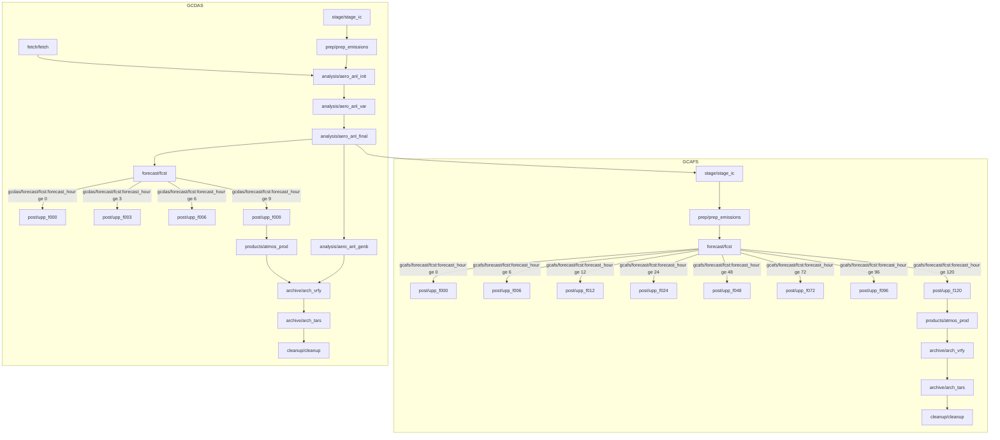

```mermaid
flowchart TD
    subgraph gcafs["GCAFS"]
        gcafs_archive_arch_tars["archive/arch_tars"]
        gcafs_archive_arch_vrfy["archive/arch_vrfy"]
        gcafs_chem_prep_prep_emissions["prep/prep_emissions"]
        gcafs_cleanup_cleanup["cleanup/cleanup"]
        gcafs_forecast_fcst["forecast/fcst"]
        gcafs_post_upp_f000["post/upp_f000"]
        gcafs_post_upp_f006["post/upp_f006"]
        gcafs_post_upp_f012["post/upp_f012"]
        gcafs_post_upp_f024["post/upp_f024"]
        gcafs_post_upp_f048["post/upp_f048"]
        gcafs_post_upp_f072["post/upp_f072"]
        gcafs_post_upp_f096["post/upp_f096"]
        gcafs_post_upp_f120["post/upp_f120"]
        gcafs_products_atmos_prod["products/atmos_prod"]
        gcafs_stage_stage_ic["stage/stage_ic"]
    end
    subgraph gcdas["GCDAS"]
        gcdas_archive_arch_tars["archive/arch_tars"]
        gcdas_archive_arch_vrfy["archive/arch_vrfy"]
        gcdas_chem_analysis_aero_anl_final["analysis/aero_anl_final"]
        gcdas_chem_analysis_aero_anl_genb["analysis/aero_anl_genb"]
        gcdas_chem_analysis_aero_anl_init["analysis/aero_anl_init"]
        gcdas_chem_analysis_aero_anl_var["analysis/aero_anl_var"]
        gcdas_chem_prep_prep_emissions["prep/prep_emissions"]
        gcdas_cleanup_cleanup["cleanup/cleanup"]
        gcdas_fetch_fetch["fetch/fetch"]
        gcdas_forecast_fcst["forecast/fcst"]
        gcdas_post_upp_f000["post/upp_f000"]
        gcdas_post_upp_f003["post/upp_f003"]
        gcdas_post_upp_f006["post/upp_f006"]
        gcdas_post_upp_f009["post/upp_f009"]
        gcdas_products_atmos_prod["products/atmos_prod"]
        gcdas_stage_stage_ic["stage/stage_ic"]
    end
    gcdas_stage_stage_ic --> gcdas_chem_prep_prep_emissions
    gcdas_fetch_fetch --> gcdas_chem_analysis_aero_anl_init
    gcdas_chem_prep_prep_emissions --> gcdas_chem_analysis_aero_anl_init
    gcdas_chem_analysis_aero_anl_init --> gcdas_chem_analysis_aero_anl_var
    gcdas_chem_analysis_aero_anl_var --> gcdas_chem_analysis_aero_anl_final
    gcdas_chem_analysis_aero_anl_final --> gcdas_chem_analysis_aero_anl_genb
    gcdas_chem_analysis_aero_anl_final --> gcdas_forecast_fcst
    gcdas_forecast_fcst -->|"gcdas/forecast/fcst:forecast_hour ge 0"| gcdas_post_upp_f000
    gcdas_forecast_fcst -->|"gcdas/forecast/fcst:forecast_hour ge 3"| gcdas_post_upp_f003
    gcdas_forecast_fcst -->|"gcdas/forecast/fcst:forecast_hour ge 6"| gcdas_post_upp_f006
    gcdas_forecast_fcst -->|"gcdas/forecast/fcst:forecast_hour ge 9"| gcdas_post_upp_f009
    gcdas_post_upp_f009 --> gcdas_products_atmos_prod
    gcdas_products_atmos_prod --> gcdas_archive_arch_vrfy
    gcdas_chem_analysis_aero_anl_genb --> gcdas_archive_arch_vrfy
    gcdas_archive_arch_vrfy --> gcdas_archive_arch_tars
    gcdas_archive_arch_tars --> gcdas_cleanup_cleanup
    gcdas_chem_analysis_aero_anl_final --> gcafs_stage_stage_ic
    gcafs_stage_stage_ic --> gcafs_chem_prep_prep_emissions
    gcafs_chem_prep_prep_emissions --> gcafs_forecast_fcst
    gcafs_forecast_fcst -->|"gcafs/forecast/fcst:forecast_hour ge 0"| gcafs_post_upp_f000
    gcafs_forecast_fcst -->|"gcafs/forecast/fcst:forecast_hour ge 6"| gcafs_post_upp_f006
    gcafs_forecast_fcst -->|"gcafs/forecast/fcst:forecast_hour ge 12"| gcafs_post_upp_f012
    gcafs_forecast_fcst -->|"gcafs/forecast/fcst:forecast_hour ge 24"| gcafs_post_upp_f024
    gcafs_forecast_fcst -->|"gcafs/forecast/fcst:forecast_hour ge 48"| gcafs_post_upp_f048
    gcafs_forecast_fcst -->|"gcafs/forecast/fcst:forecast_hour ge 72"| gcafs_post_upp_f072
    gcafs_forecast_fcst -->|"gcafs/forecast/fcst:forecast_hour ge 96"| gcafs_post_upp_f096
    gcafs_forecast_fcst -->|"gcafs/forecast/fcst:forecast_hour ge 120"| gcafs_post_upp_f120
    gcafs_post_upp_f120 --> gcafs_products_atmos_prod
    gcafs_products_atmos_prod --> gcafs_archive_arch_vrfy
    gcafs_archive_arch_vrfy --> gcafs_archive_arch_tars
    gcafs_archive_arch_tars --> gcafs_cleanup_cleanup
```